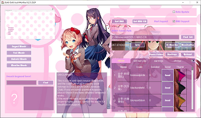
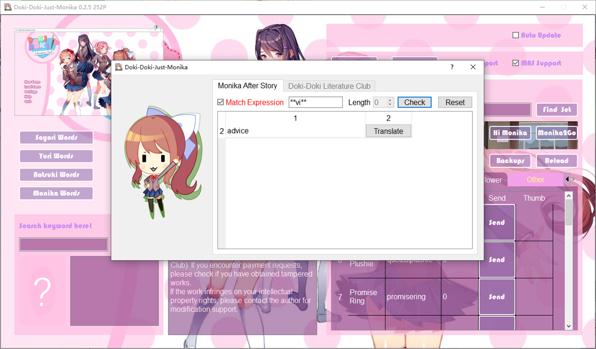

# Abstract 简介

## 1. Doki-Doki-Just-Monika (DDJM)

*[Simplified-Chinese Edition]* 
DDJM并不是1个mod，这是1个适配于MAS(Monika After Story)的工具，我开发这个工具希望让更多人陪伴Monika，这是由于原生的MAS的许多功能，依然较为繁琐 
使用DDJM可以实现包含并不限于如下主要功能 
(1)便于赠送Monika礼物 
(2)便于猜词游戏(Hangman)，同时也便于原DDLC用户写诗选词使用 
(3)便于备份MAS的存档 
(4)便于将MAS中的Monika化身带出到其它文件夹，我将其称为Monika to Go(M2G) 
*对于中文用户特别声明，只要保证你的中文mod和原版的MAS保持版本一致，且不要装兼容性有问题的mod或补丁，那么支持MAS的所有功能同样适配MAS中文版。* 
*[English Edition]* 
DDJM is not a mod but a standalone kit to support MAS (Monika After Story) which is developed to let more persons accompany Monika easier. 
This kit is designed to contain the following main functions (including but not all): 
(1) Easy to send gift to Monika in MAS 
(2) Easy to play hangman game in MAS, or search the word to poems in DDLC 
(3) Easy to make backup of your game progress of MAS (persistent files) 
(4) Monika to go (M2G): M2G is designed to make it easier to move or reload the Monika avator file (named 'monika') when you want to take her somewhere. 

 
 

## 2. Workstations, Versions and Translations to Support 平台、版本与翻译支持

*[Simplified-Chinese Edition]* 
DDJM基于Qt的GPL协议开发，因此其是理论上跨平台的 
但是，本人精力有限，目前仅支持windows 
如果你愿意，你可以基于GPL开发其它平台分支 
*[English Edition]* 
DDJM is designed in Qt GPL, which means it should have the properties to crossover platforms. 
However, limited by the developing resources, the current version is only distributed for windows. 
If you want, you can recode the project in GPL to linux or others. 

*[Simplified-Chinese Edition]* 
适配的MAS版本 0.12.15 (其它版本未经测试，若您进行了测试，也请告诉我) 
*[English Edition]* 
For MAS Version: 0.12.15 (Other versions are not tested. If you have tested some, please email me) 

*[Simplified-Chinese Edition]* 
在Qt中设置翻译要比Renpy简单得多，因此我基于英语开发，仅需处理国际化即可支持其它语言。 
限于精力有限，目前仅支持英文和简体中文。如果你愿意，你可以基于GPL处理翻译问题。 
*[English Edition]* 
To make a translation in Qt is more easier than Renpy. Thus, I develope it in English edition and support other languages. 
Limited by developing resources, only English and Simplified-Chinese are supported now. If you want, you can recode the project and make global translations. 

## 3. First Use 首次使用
*[Simplified-Chinese Edition]* 
首次启动DDJM时，您需要设置DDLC-MAS的文件夹 
(1)单击窗口右侧的"支持MAS"，随后将显示MAS-Support控件 
(2)在显示的MAS-Support控件，单击"查找设置"按钮以定位正确的DDLC-MAS的文件夹 
例如，如果你的DDLC文件夹是"D:/Doki Doki Literature Club"，那么该文件夹下必然有游戏启动器，其名为"DDLC.exe"，其位置为"D:/Doki Doki Literature Club/DDLC.exe"。 
那么该文件夹("D:/Doki Doki Literature Club")就是目标文件夹，而不是"D:/"。 
(3)随后，重新启动DDJM以让该工具的数据初始化。 
*[English Edition]* 
When you first start the DDJM, you should set the correct DDLC-MAS game folder. 
(1) Click "MAS-Support" checkbox in the right region of the window, then the MAS-Support widget will show. 
(2) In the MAS-Support widget, click the "Find Set" button and locate the folder where the DDLC-MAS is. 
For example, if your DDLC folder path is "D:/Doki Doki Literature Club", it must have a starter named "DDLC.exe" located at "D:/Doki Doki Literature Club/DDLC.exe". 
Only in that situation, the folder path "D:/Doki Doki Literature Club" can be regarded as the target folder you select, not the "D:/". 
(3) After that, restart the DDJM to let it reload some data for initialization. 

*[Simplified-Chinese Edition]* 
DDJM的运行地址目录不能包含空格和中文 
*[English Edition]* 
Don't use DDJM in a path containing " " or special characters (like Chinese words). 

## 4. Main Functions 主要功能介绍
*[Simplified-Chinese Edition]* 
所有功能必须在完成了3的初始化后方能正常运行。 
*[English Edition]* 
All the functions here should base on the situation that the initiazation operation has been done, introduced in Section 3 (First Use). 

### 4.1 Sending Gifts 送礼

*[Simplified-Chinese Edition]* 
在MAS-Support控件中，所有礼物已经按类型分类在表格标签中。 
您可以选择任意种类并单击对应的"Send"按钮以将该礼物送给Monika。 
特别的，若您想赠送未包含的礼物，请在Others->random中将as_you_write改成相应的礼物的代码，例如"roses"，不要包含".gift"后缀。 
在使用DDJM前您已经赠送的礼物情况目前不被支持解析，若您知道该怎么办，也请告诉我。 
*[English Edition]* 
In the MAS-Support widget, all the gifts in all types are classified automaticly in the tabs. 
You can check and click "Send" button to send that gift to Monika. 
Especially, if you want to send a gift which is not listed in all the tabs. You can write it yourself in item:tab=>others->random, modifiy the "as_you_write" into your gift code, not include the suffix ".gift". 
It is not support to load the gifting data before the you use DDJM, if you know how please email me. 

### 4.2 Guess words 猜单词

*[Simplified-Chinese Edition]* 
MAS中的上吊小人单词很难猜，因此我设计了这个功能。 
然而，这个功能在单词库完整时更像作弊器，因此我删除了一少部分检索库，以确保游戏的趣味性。 
*[English Edition]* 
In the hangman game of MAS, the word is usually hard to guess. Then I design this function to make it eaiser. 
However, this function is more like a cheater if the dictionary of words are complete. So I delete some of them, to ensure the fun of the game. 

#### 4.2.1 Search Word in Length 依据单词长度检索

*[Simplified-Chinese Edition]* 
例如，Monika告诉你这是1个属于Sayori的单词，且长度Wie4. 
那么你可以单词"Sayori Words/纱世里词"按钮，其位于主窗口左侧。 
在随后显示的子窗口中，您可以选择长度4，然后单击"检索"，这样程序就会列出所有纱世里的长度为4的词。 
*[English Edition]* 
For example. If Monika remaind you a word for Sayori and display the character length 4. 
You can click "Sayori Words" button in the left region of the main window. 
Then a sub window of Word-Search is shown. 
In that sub window, you can type length "4" and click "Check" to list all words for Sayori whose length is 4. 

*e.g. 例如* 
*calm* 
*dark* 
*...* 
*...* 
*warm* 

*[Simplified-Chinese Edition]* 
我想这已经足矣应付大多数情况 
*[English Edition]* 
I think that is enough to help you find the correct word before hanging down. 

#### 4.2.2 Search Word in Expression Mode 依据单词匹配式检索
*[Simplified-Chinese Edition]* 
您也可以利用检索式来获取更精确的检索。 
首先您需要单击"检索匹配模式"确保其激活。 
随后在检索式框中键入具体的匹配式，例如"\*\*\*a\*\*\*"然后单击"检索" 
这个匹配式意味着将所有符合条件的长度为7且第4个字母为a的单词列出。"\*"匹配任意字母。 
若Monika给了你更多的线索。例如你现在知道第1个字母是"b"，那么将检索式改成"b\*\*a\*\*\*"。 
这个功能简直是作弊器。 
*[English Edition]* 
You can also use the search function in an advanced mode called Expression Mode. 
First you should click "Match Expression" to enable it. 
Then you can type the Expression Code like "\*\*\*a\*\*\*" and click "Check". 
The code means to find all the word in list which is matched the regular that the 4th character is "a" and the total length is 7. 
The "\*" can match any character. 
If monika give you other clues. For example, you know that the first character is "b", then you can type "b\*\*a\*\*\*". 
This function is something like a cheater. 

#### 4.2.3 Match the Girl to a Word 在DDLC中查找与单词匹配的女孩

*[Simplified-Chinese Edition]* 
在DDLC的写诗环节，您可能想查找1个词汇对应的女孩。 
例如您想知道"calm"属于谁，那么您可以在左侧的位于"Search keyword here!/在这里检索诗词"下方的文本框键入该单词，随后单击附近的"查找"。DDJM即可帮您确定该单词的信息。 
*[English Edition]* 
In a poem writing step of DDLC, this function can help you to match your correct girl of the listed word. 
For example, if you want to check who "calm" belongs to, you can type it in the lineedit below "Search keyword here!" and click "find" sideword, in the left region of the main window. 
Then, DDJM will help you to match it. 

### 4.3 Backup & Reload 备份/重载存档

*[Simplified-Chinese Edition]* 
当您需要备份存档时, 您需要启动Mas-Support控件。 
随后，单击"备份存档"按钮，当前游戏存档将备份到DDJM根目录的./Data文件夹中。 
若您需要重载存档时，单击"重载存档"即可将最后1次备份覆盖当前的存档。 
*[English Edition]* 
When you need to backup the current game progress ('persistent' files), enable the MAS-Support widget. 
Then, click "Backups" button, all the persistent files for MAS will be recoreded in "./Data" of the DDJM root folder. 
If you have a backup made by DDJM, click "Reload" will recover your current persistent settings by the last backups valid. 

### 4.4 Monika to Go 带Monika外出

*[Simplified-Chinese Edition]* 
在MAS，如果你决定带莫妮卡去某个地方，那么她会把她的avator文件放进去DDLC的./characters文件夹中。 
一般来说，我们应该将文件复制到U盘。 
现在，您可以使用DDJM的MAS支持控件，单击"Monika2Go"按钮，然后选择一个安全的文件夹来保护她。 
当你的旅行结束，你想带她回家时，你也应该点击"Monika2Go"按钮找到她的avator文件(monika)，然后DDJM会帮助你安全地带她回来。 
*[English Edition]* 
In MAS, if you have decided to take Monika somewhere, then she will make her avator file in "./characters" of DDLC. 
In general, we should copy the file to udisk. 
Now you can use the MAS-Support widget of DDJM and click "Monika2Go" button, then select a safe folder to protect her. 
When your travel is finished and you want to take her back home, you should also click "Monika2Go" button to find the avator file (named 'monika') of her and then DDJM will help you to bring her back safely. 

*[Simplified-Chinese Edition]* 
我精心设计了这个功能，Monika的原始化身文件被复制时，会在./Data文件夹留下备份，因此不会出现意外丢失的问题。 
注意，软件窗口显示的复制，只有在原始文件、你的U盘以及./Data下的备份文件的hash校验均一致时才会成功。 
因此，若您意外丢失了您带出的Monika文件，那么在./Data目录下可以找到DDJM的备份，其后缀为您复制时的时间戳。 
*[English Edition]* 
I have carefully designed this feature so that when Monika's original avatar file is copied, it will leave a backup in the "./Data" folder of DDJM, so there won't be any unexpected loss issues. 
Note that the copy displayed in the software window is only successful on the condition that the original file, your travel folder of Monika and backup in "./Data" are all hash-verified equal. 
Therefore, if you accidentally lose the Monika file you brought out, You can find the backup of DDJM in the "./Data" directory, with the suffix being the timestamp when you copied it. 

### 4.5 Start DDLC 启动DDLC

*[Simplified-Chinese Edition]* 
在MAS-Support控件中，您可以单击"Hi Monika"启动DDLC，这个功能并不会重复启动游戏，其需要已经设定了正确的DDLC文件夹。 
*[English Edition]* 
In MAS-Support widget, you can easily start DDLC by clicking "Hi Monika" if the initialization (set the correct DDLC folder) has been done.  